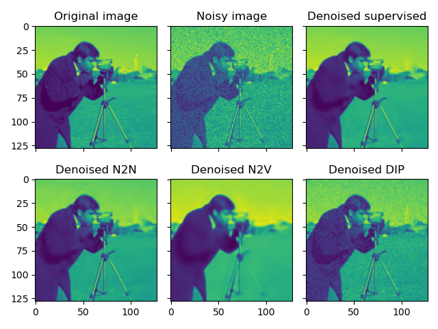

# Denoising Images

Auto-Denoise (autoden) provides implementations for a variety of unsupervised and self-supervised Convolutional Neural Network (CNN) denoising methods. This tutorial will guide you through setting up the data, training different denoisers, performing inference, and visualizing the results.

## Setting Up the Data

First, we need to set up the data to be used for training and testing the denoisers. We will use the `skimage` library to generate a noisy image and create multiple noisy versions of it.

```python
import matplotlib.pyplot as plt
import numpy as np
import skimage.color as skc
import skimage.data as skd
import skimage.transform as skt
from numpy.typing import NDArray
from tqdm.auto import tqdm
import autoden as ad

USE_CAMERA_MAN = True
NUM_IMGS_TRN = 4
NUM_IMGS_TST = 2
NUM_IMGS_TOT = NUM_IMGS_TRN + NUM_IMGS_TST

EPOCHS = 1024
REG_TV_VAL = 1e-7

if USE_CAMERA_MAN:
    img_orig = skd.camera()
    img_orig = skt.downscale_local_mean(img_orig, 4)
else:
    img_orig = skd.cat()
    img_orig = skc.rgb2gray(img_orig)
    img_orig *= 255 / img_orig.max()

imgs_noisy: NDArray = np.stack(
    [(img_orig + 20 * np.random.randn(*img_orig.shape)) for _ in tqdm(range(NUM_IMGS_TOT), desc="Create noisy images")],
    axis=0,
)
tst_inds = np.arange(NUM_IMGS_TRN, NUM_IMGS_TOT)

print(f"Img orig -> [{img_orig.min()}, {img_orig.max()}], Img noisy -> [{imgs_noisy[0].min()}, {imgs_noisy[0].max()}]")
print(f"Img shape: {img_orig.shape}")
```

!!! note "Training vs testing images"

    Certain algorithms require to allocate a certain number of input images to the test set.
    This set is used to verify the model's training convergence, and to select the most appropriate epoch.
    The variable `tst_inds` serves this purpose, by containing the indexes of the images to use for testing.

    The algorithms that do not use this variable, will randomly select a certain fixed number of pixels as leave-out set.

## Training the Denoisers

We will train four different denoisers: Supervised Denoiser, Noise2Noise (N2N), Noise2Void (N2V), and Deep Image Prior (DIP).
We first define the type of model that we will want to use. In this case it will be a U-net [[1](#ref.1)], with 16 features:
```python
net_params = ad.NetworkParamsUNet(n_features=16)
```

The variable `net_params` only defines the type of architecture that we want. When passed to the denoising algorithms, they will use it to create and initialize a U-net model.
Other pre-configured models are available: MS-D net [[2](#ref.2)], DnCNN [[3](#ref.3)], and a custom ResNet implementation [[4](#ref.4)].

### Supervised Denoiser

The supervised denoiser is trained using pairs of noisy and clean images. It learns to map noisy images to their clean counterparts.

```python
denoiser_sup = ad.Denoiser(model=net_params, reg_val=REG_TV_VAL)
denoiser_sup.train_supervised(imgs_noisy, img_orig, epochs=EPOCHS, tst_inds=tst_inds)
```

### Noise2Noise (N2N)

Noise2Noise is a self-supervised denoising method that uses pairs of noisy images of the same object [[5](#ref.5)]. It learns to map one noisy image to another noisy image of the same object.

```python
denoiser_n2n = ad.N2N(model=net_params, reg_val=REG_TV_VAL)
denoiser_n2n.train_selfsupervised(imgs_noisy, epochs=EPOCHS)
```

### Noise2Void (N2V)

Noise2Void is a self-supervised denoising method that can work with a single noisy image [[6](#ref.6)]. This implementation can also work with structured noise [[7](#ref.7)]. It applies randomly generated masks to the images and learns to predict the masked pixels.

```python
denoiser_n2v = ad.N2V(model=net_params, reg_val=REG_TV_VAL)
denoiser_n2v.train_selfsupervised(imgs_noisy, epochs=EPOCHS, tst_inds=tst_inds)
```

### Deep Image Prior (DIP)

Deep Image Prior is an unsupervised denoising method that can also work with a single image [[8](#ref.8)]. It uses the prior knowledge embedded in the network architecture to denoise the image.

```python
denoiser_dip = ad.DIP(model=net_params, reg_val=REG_TV_VAL)
inp_dip = denoiser_dip.train_unsupervised(imgs_noisy, epochs=EPOCHS)
```

## Performing Inference

Inference is the process of using the trained models to denoise new images. The `infer` method takes the noisy images as input and outputs the denoised images.

### Supervised Denoiser Inference

```python
den_sup = denoiser_sup.infer(imgs_noisy).mean(0)
```

### Noise2Noise (N2N) Inference

```python
den_n2n = denoiser_n2n.infer(imgs_noisy).mean(0)
```

### Noise2Void (N2V) Inference

```python
den_n2v = denoiser_n2v.infer(imgs_noisy).mean(0)
```

### Deep Image Prior (DIP) Inference

```python
den_dip = denoiser_dip.infer(inp_dip)
```

## Visualizing the Results

Finally, we will visualize the results of the different denoisers.

=== "Image"
    

=== "Code"
    ```python
    fig, axs = plt.subplots(2, 3, sharex=True, sharey=True)
    axs[0, 0].imshow(img_orig)
    axs[0, 0].set_title("Original image")
    axs[0, 1].imshow(imgs_noisy[0])
    axs[0, 1].set_title("Noisy image")
    axs[0, 2].imshow(den_sup)
    axs[0, 2].set_title("Denoised supervised")
    axs[1, 0].imshow(den_n2n)
    axs[1, 0].set_title("Denoised N2N")
    axs[1, 1].imshow(den_n2v)
    axs[1, 1].set_title("Denoised N2V")
    axs[1, 2].imshow(den_dip)
    axs[1, 2].set_title("Denoised DIP")
    fig.tight_layout()
    plt.show(block=False)
    ```

## References

1. <a id="ref.1"></a> O. Ronneberger, P. Fischer, and T. Brox, “U-Net: Convolutional Networks for Biomedical Image Segmentation,” in Medical Image Computing and Computer-Assisted Intervention – MICCAI 2015, 2015, pp. 234–241. doi: 10.1007/978-3-319-24574-4_28.
2. <a id="ref.2"></a> D. M. Pelt and J. A. Sethian, “A mixed-scale dense convolutional neural network for image analysis,” Proceedings of the National Academy of Sciences, vol. 115, no. 2, pp. 254–259, 2018, doi: 10.1073/pnas.1715832114.
3. <a id="ref.3"></a> K. Zhang, W. Zuo, Y. Chen, D. Meng, and L. Zhang, “Beyond a Gaussian Denoiser: Residual Learning of Deep CNN for Image Denoising,” IEEE Transactions on Image Processing, vol. 26, no. 7, pp. 3142–3155, Jul. 2017, doi: 10.1109/TIP.2017.2662206.
4. <a id="ref.4"></a> K. He, X. Zhang, S. Ren, and J. Sun, “Deep Residual Learning for Image Recognition,” in 2016 IEEE Conference on Computer Vision and Pattern Recognition (CVPR), IEEE, Jun. 2016, pp. 770–778. doi: 10.1109/CVPR.2016.90.
5. <a id="ref.5"></a> J. Lehtinen et al., “Noise2Noise: Learning Image Restoration without Clean Data,” in Proceedings of the 35th International Conference on Machine Learning, J. Dy and A. Krause, Eds., in Proceedings of Machine Learning Research, vol. 80. PMLR, 2018, pp. 2965–2974. https://proceedings.mlr.press/v80/lehtinen18a.html.
6. <a id="ref.6"></a> A. Krull, T.-O. Buchholz, and F. Jug, “Noise2Void - Learning Denoising From Single Noisy Images,” in 2019 IEEE/CVF Conference on Computer Vision and Pattern Recognition (CVPR), IEEE, Jun. 2019, pp. 2124–2132. doi: [10.1109/CVPR.2019.00223](https://doi.org/10.1109/CVPR.2019.00223).
7. <a id="ref.7"></a> C. Broaddus, A. Krull, M. Weigert, U. Schmidt, and G. Myers, “Removing Structured Noise with Self-Supervised Blind-Spot Networks,” in 2020 IEEE 17th International Symposium on Biomedical Imaging (ISBI), IEEE, Apr. 2020, pp. 159–163. doi: [10.1109/ISBI45749.2020.9098336](https://doi.org/10.1109/ISBI45749.2020.9098336).
8. <a id="ref.8"></a> V. Lempitsky, A. Vedaldi, and D. Ulyanov, “Deep Image Prior,” in 2018 IEEE/CVF Conference on Computer Vision and Pattern Recognition, IEEE, Jun. 2018, pp. 9446–9454. doi: [10.1109/CVPR.2018.00984](https://doi.org/10.1109/CVPR.2018.00984).
