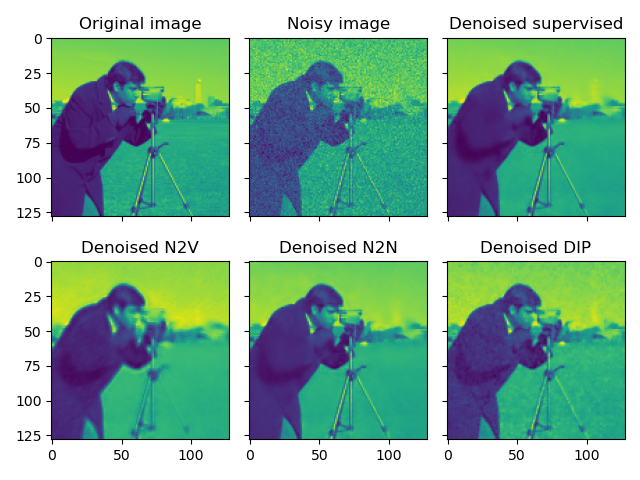
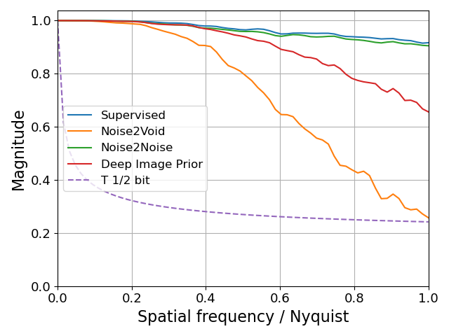

# Denoising Images

Auto-Denoise (autoden) provides implementations for a variety of unsupervised and self-supervised Convolutional Neural Network (CNN) denoising methods. This tutorial will guide you through setting up the data, training different denoisers, performing inference, and visualizing the results.

## Setting Up the Data

First, we need to set up the data to be used for training and testing the denoisers. We will use the `skimage` library to generate a noisy image and create multiple noisy versions of it.

```python
import matplotlib.pyplot as plt
import numpy as np
import skimage.color as skc
import skimage.data as skd
import skimage.transform as skt
from numpy.typing import NDArray
from tqdm.auto import tqdm
import autoden as ad

USE_CAMERA_MAN = True
NUM_IMGS_TRN = 4
NUM_IMGS_TST = 2
NUM_IMGS_TOT = NUM_IMGS_TRN + NUM_IMGS_TST

EPOCHS = 1024
REG_TV_VAL = 1e-7

if USE_CAMERA_MAN:
    img_orig = skd.camera()
    img_orig = skt.downscale_local_mean(img_orig, 4)
else:
    img_orig = skd.cat()
    img_orig = skc.rgb2gray(img_orig)
    img_orig *= 255 / img_orig.max()

imgs_noisy: NDArray = np.stack(
    [(img_orig + 20 * np.random.randn(*img_orig.shape)) for _ in tqdm(range(NUM_IMGS_TOT), desc="Create noisy images")],
    axis=0,
)
tst_inds = np.arange(NUM_IMGS_TRN, NUM_IMGS_TOT)

print(f"Img orig -> [{img_orig.min()}, {img_orig.max()}], Img noisy -> [{imgs_noisy[0].min()}, {imgs_noisy[0].max()}]")
print(f"Img shape: {img_orig.shape}")
```

!!! note "Training vs testing images"

    Certain algorithms require to allocate a certain number of input images to the test set.
    This set is used to verify the model's training convergence, and to select the most appropriate epoch.
    The variable `tst_inds` serves this purpose, by containing the indexes of the images to use for testing.

    The algorithms that do not use this variable, will randomly select a certain fixed number of pixels as leave-out set.

## Training the Denoisers

We will train four different denoisers: Supervised Denoiser, Noise2Noise (N2N), Noise2Void (N2V), and Deep Image Prior (DIP).
We first define the type of model that we will want to use. In this case it will be a U-net [[1](#ref.1)], with 16 features:
```python
net_params = ad.NetworkParamsUNet(n_features=16)
```

The variable `net_params` only defines the type of architecture that we want. When passed to the denoising algorithms, they will use it to create and initialize a U-net model.
Other pre-configured models are available: MS-D net [[2](#ref.2)], DnCNN [[3](#ref.3)], and a custom ResNet implementation [[4](#ref.4)].

### 1D and 3D signals

We have recently introduced the support for 1D and 3D signals in `auto-denoise`.
To correctly process these signals, it is enough to instantiate a model with the correct dimensionality.
This means that we need to set the correct value for the parameter `n_dims` in the model definition:
```python
net_params = ad.NetworkParamsUNet(n_features=16, n_dims=1)  # 1D Convolutions
```
or
```python
net_params = ad.NetworkParamsUNet(n_features=16, n_dims=3)  # 3D Convolutions
```

!!! node "Using a 2D model with 3D data"

    It is possible to use a 3D dataset with a 2D model. The depth direction will be interpreted as the batch dimension.
    The 2D model will interpret each volume slice as a different image example.

    This could be useful in GPU memory constrained scenarios, where the higher memory requirements of 3D convolutions (w.r.t. 2D convolutions) could exceed the available GPU memory.
    This technique could save around 30\% memory, but it would lose the information along the depth direction.

### Supervised Denoiser

The supervised denoiser is trained using pairs of noisy and clean images. It learns to map noisy images to their clean counterparts.

```python
denoiser_sup = ad.Supervised(model=net_params, reg_val=REG_TV_VAL)
sup_data = denoiser_sup.prepare_data(imgs_noisy, img_orig, num_tst_ratio=NUM_IMGS_TST / NUM_IMGS_TOT)
denoiser_sup.train(*sup_data, epochs=EPOCHS)
```

### Noise2Void (N2V)

Noise2Void is a self-supervised denoising method that can work with a single noisy image [[5](#ref.5)]. This implementation can also work with structured noise [[6](#ref.6)]. It applies randomly generated masks to the images and learns to predict the masked pixels.

```python
denoiser_n2v = ad.N2V(model=net_params, reg_val=REG_TV_VAL)
denoiser_n2v.train(imgs_noisy, epochs=EPOCHS, tst_inds=tst_inds)
```

### Noise2Noise (N2N)

Noise2Noise is a self-supervised denoising method that uses pairs of noisy images of the same object [[7](#ref.7)]. It learns to map one noisy image to another noisy image of the same object. The `prepare_data` function is used to organize the data in such a way that the algorithm can handle it correctly.

```Python
denoiser_n2n = ad.N2N(model=net_params, reg_val=REG_TV_VAL)
n2n_data = denoiser_n2n.prepare_data(imgs_noisy)
denoiser_n2n.train(*n2n_data, epochs=EPOCHS)
```

#### Batched processing

N2N and Supervised support batched processing (both during training and inference). This is usually required for large datasets, where they cannot fully fit into GPU memory.
The batch size is selected through the `batch_size` argument when N2N is initialized.

```Python
denoiser_sup = ad.Supervised(model=net_params, reg_val=REG_TV_VAL, batch_size=16)
```

and

```Python
denoiser_n2n = ad.N2N(model=net_params, reg_val=REG_TV_VAL, batch_size=16)
```

#### Data augmentation

N2N and Supervised also support data augmentation in the form of image and volume flips. This could be used to virtually increase the data size during training.

```Python
denoiser_sup = ad.Supervised(model=net_params, reg_val=REG_TV_VAL, augmentation="flip")
```

and

```Python
denoiser_n2n = ad.N2N(model=net_params, reg_val=REG_TV_VAL, augmentation="flip")
```

### Deep Image Prior (DIP)

Deep Image Prior is an unsupervised denoising method that can also work with a single image [[8](#ref.8)]. It uses the prior knowledge embedded in the network architecture to denoise the image. The `prepare_data` function is used to organize the data in such a way that the algorithm can handle it correctly.

```Python
denoiser_dip = ad.DIP(model=net_params, reg_val=REG_TV_VAL * 1e1)
dip_data = denoiser_dip.prepare_data(imgs_noisy)
denoiser_dip.train(*dip_data, epochs=EPOCHS)
```
!!! note "Regularization weight"
    The DIP is more sensitive to the regularization weight, and it can be adjusted to obtain better results.

## Performing Inference

Inference is the process of using the trained models to denoise new images. The `infer` method takes the noisy images as input and outputs the denoised images.

### Supervised Denoiser Inference

```python
den_sup = denoiser_sup.infer(sup_data[0]).mean(0)
```
!!! note "Inference input"
    The output of the `prepare_data` function is also preferred for the inference of Supervised, even though the noisy images should still work for the foreseeable future.

### Noise2Void (N2V) Inference

```python
den_n2v = denoiser_n2v.infer(imgs_noisy).mean(0)
```

### Noise2Noise (N2N) Inference

```python
den_n2n = denoiser_n2n.infer(n2n_data[0])
```
!!! note "Inference input"
    The output of the `prepare_data` function is also needed for the inference of N2N.

!!! note "Inference output"
    The `inference` function of N2N  automatically averages the splits, unless the `average_splits` flag is set to `False`.

### Deep Image Prior (DIP) Inference

```python
den_dip = denoiser_dip.infer(dip_data[0])
```
!!! note "Inference input"
    The output of the `prepare_data` function is also needed for the inference of DIP.

## Visualizing the Results

Finally, we visualize the results of the different denoisers.

=== "Image"
    

=== "Code"
    ```python
    fig, axs = plt.subplots(2, 3, sharex=True, sharey=True)
    axs[0, 0].imshow(img_orig)
    axs[0, 0].set_title("Original image")
    axs[0, 1].imshow(imgs_noisy[0])
    axs[0, 1].set_title("Noisy image")
    axs[0, 2].imshow(den_sup)
    axs[0, 2].set_title("Denoised supervised")
    axs[1, 0].imshow(den_n2n)
    axs[1, 0].set_title("Denoised N2N")
    axs[1, 1].imshow(den_n2v)
    axs[1, 1].set_title("Denoised N2V")
    axs[1, 2].imshow(den_dip)
    axs[1, 2].set_title("Denoised DIP")
    fig.tight_layout()
    plt.show(block=False)
    ```

And here below we present the PSNR (Peak Signal-to-Noise Ration), SSIM (Structural Similarity Index) and FRC (Fourier Ring Correlation) of the results.

=== "Image"
    PSNR:
    
    - Supervised: 33.7
    - Noise2Void: 26.1
    - Noise2Noise: 32.6
    - Deep Image Prior: 29.7
    
    SSIM:
    
    - Supervised: 0.901
    - Noise2Void: 0.776
    - Noise2Noise: 0.884
    - Deep Image Prior: 0.825

    

=== "Code"
    ```python
    from corrct.processing.post import plot_frcs
    from skimage.metrics import peak_signal_noise_ratio as psnr
    from skimage.metrics import structural_similarity as ssim

    all_recs = [den_sup, den_n2v, den_n2n, den_dip]
    all_labs = ["Supervised", "Noise2Void", "Noise2Noise", "Deep Image Prior"]

    data_range = img_orig.max() - img_orig.min()
    print("PSNR:")
    for rec, lab in zip(all_recs, all_labs):
        print(f"- {lab}: {psnr(img_orig, rec, data_range=data_range):.3}")
    print("SSIM:")
    for rec, lab in zip(all_recs, all_labs):
        print(f"- {lab}: {ssim(img_orig, rec, data_range=data_range):.3}")

    plot_frcs([(img_orig.astype(np.float32), rec) for rec in all_recs], all_labs)
    ```

## References

1. <a id="ref.1"></a> O. Ronneberger, P. Fischer, and T. Brox, “U-Net: Convolutional Networks for Biomedical Image Segmentation,” in Medical Image Computing and Computer-Assisted Intervention – MICCAI 2015, 2015, pp. 234–241. doi: 10.1007/978-3-319-24574-4_28.
2. <a id="ref.2"></a> D. M. Pelt and J. A. Sethian, “A mixed-scale dense convolutional neural network for image analysis,” Proceedings of the National Academy of Sciences, vol. 115, no. 2, pp. 254–259, 2018, doi: 10.1073/pnas.1715832114.
3. <a id="ref.3"></a> K. Zhang, W. Zuo, Y. Chen, D. Meng, and L. Zhang, “Beyond a Gaussian Denoiser: Residual Learning of Deep CNN for Image Denoising,” IEEE Transactions on Image Processing, vol. 26, no. 7, pp. 3142–3155, Jul. 2017, doi: 10.1109/TIP.2017.2662206.
4. <a id="ref.4"></a> K. He, X. Zhang, S. Ren, and J. Sun, “Deep Residual Learning for Image Recognition,” in 2016 IEEE Conference on Computer Vision and Pattern Recognition (CVPR), IEEE, Jun. 2016, pp. 770–778. doi: 10.1109/CVPR.2016.90.
5. <a id="ref.5"></a> A. Krull, T.-O. Buchholz, and F. Jug, “Noise2Void - Learning Denoising From Single Noisy Images,” in 2019 IEEE/CVF Conference on Computer Vision and Pattern Recognition (CVPR), IEEE, Jun. 2019, pp. 2124–2132. doi: [10.1109/CVPR.2019.00223](https://doi.org/10.1109/CVPR.2019.00223).
6. <a id="ref.6"></a> C. Broaddus, A. Krull, M. Weigert, U. Schmidt, and G. Myers, “Removing Structured Noise with Self-Supervised Blind-Spot Networks,” in 2020 IEEE 17th International Symposium on Biomedical Imaging (ISBI), IEEE, Apr. 2020, pp. 159–163. doi: [10.1109/ISBI45749.2020.9098336](https://doi.org/10.1109/ISBI45749.2020.9098336).
7. <a id="ref.7"></a> J. Lehtinen et al., “Noise2Noise: Learning Image Restoration without Clean Data,” in Proceedings of the 35th International Conference on Machine Learning, J. Dy and A. Krause, Eds., in Proceedings of Machine Learning Research, vol. 80. PMLR, 2018, pp. 2965–2974. https://proceedings.mlr.press/v80/lehtinen18a.html.
8. <a id="ref.8"></a> V. Lempitsky, A. Vedaldi, and D. Ulyanov, “Deep Image Prior,” in 2018 IEEE/CVF Conference on Computer Vision and Pattern Recognition, IEEE, Jun. 2018, pp. 9446–9454. doi: [10.1109/CVPR.2018.00984](https://doi.org/10.1109/CVPR.2018.00984).
