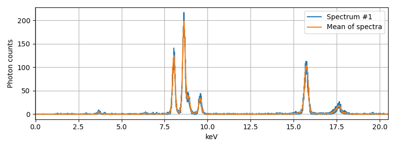
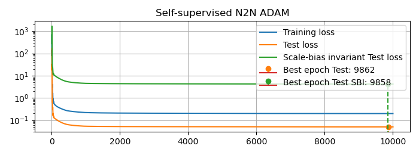
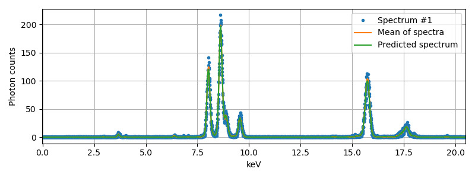
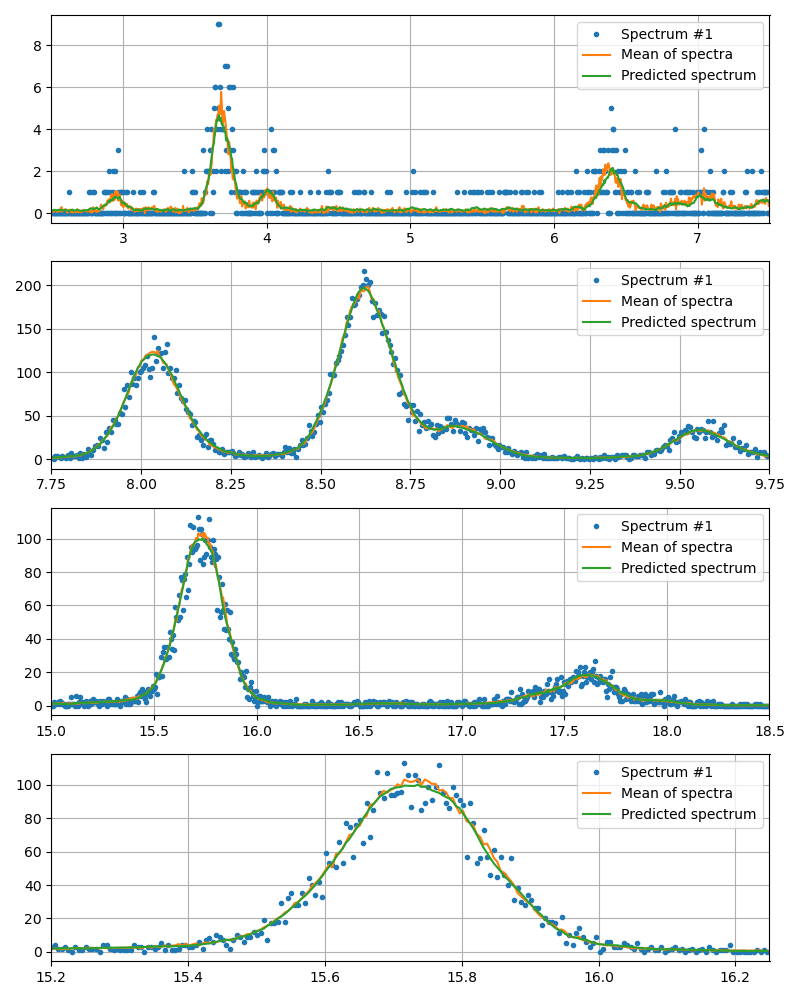

# Denoising Spectra using Noise2Noise

Auto-Denoise (autoden) provides implementations for a variety of unsupervised and self-supervised Convolutional Neural Network (CNN) denoising methods. This tutorial will guide you through setting up the data, training the Noise2Noise (N2N) denoiser, performing inference, and visualizing the results using X-ray fluorescence (XRF) spectral data.

**The main idea of this tutorial is to show how we can predict higher quality spectra from shorter acquisitions.**
In particular, we present the case of a long 3.2 seconds XRF acquisition, obtained by accumulating 32 shorter exposures of 0.1 seconds each. Here, we show that we can obtain accurate spectra with only 4 of those 0.1 seconds acquisitions, thus reducing measurement time and deposited dose by 8 times.

## Setting Up the Data

First, we need to set up the data to be used for training and testing the denoiser. We will use the `pandas` library to load the XRF spectral data from the provided CSV file.

```python
import matplotlib.pyplot as plt
import numpy as np
import pandas as pd
import autoden as ad

# Load the XRF spectral data from a CSV file
xrf_data = pd.read_csv("05_xrf_spectra.csv")

# Extract the energy values and count values
energies_keV = np.array([float(e) for e in xrf_data.columns[1:-1]])
counts = xrf_data.to_numpy()[:, 1:-1]

# Plot the original spectra
fig, axs = plt.subplots(1, 1, figsize=(8, 3))
axs.plot(energies_keV, counts[0], label="Spectrum #1")
axs.plot(energies_keV, counts.mean(axis=0), label="Mean of spectra")
axs.set_xlim(energies_keV[0], energies_keV[-1])
axs.grid()
axs.legend()
fig.tight_layout()
```


## Training the Noise2Noise Denoiser

We will train the Noise2Noise (N2N) denoiser using the XRF spectral data. We first define the type of model that we will want to use. In this case, it will be a DnCNN [[1](#ref.1)], with 4 features and 6 layers:

```python
model = ad.NetworkParamsDnCNN(n_dims=1, n_features=4, n_layers=6).get_model()
```

This model is very small for CNN model standards (only 256 parameters!), as the data is quite simple, and we do not want the model to overfit the data.

### Noise2Noise (N2N)

Noise2Noise is a self-supervised denoising method that uses pairs of noisy images of the same object [[2](#ref.2)]. It learns to map one noisy image to another noisy image of the same object. The `prepare_data` function is used to organize the data in such a way that the algorithm can handle it correctly.

```python
n2n = ad.N2N(model=model, reg_val=None)
n2n_data = n2n.prepare_data(counts[:4])
_ = n2n.train(*n2n_data, epochs=10_000, lower_limit=0.0, learning_rate=1e-2, restarts=1)
```


Here, we impose a lower limit of 0.0, as we know that the detected photons cannot be negative. We also set a high initial learning rate, to speed up the convergence (after all, we're starting from a completely untrained /  randomly initialized network). However, we then progressively reduce the learning using a cosine annealing scheduler, through the `restarts=1` argument. This value would allow us to do multiple waves of high-to-low learning rate variations for a number of restarts > 1, but that is unnecessary in this instance.

## Performing Inference

Inference is the process of using the trained model to denoise new spectra. The `infer` method takes the noisy spectra as input and outputs the denoised spectra.

```python
pred_counts = n2n.infer(n2n_data[0])
```

## Visualizing the Results

Finally, we visualize the results of the Noise2Noise denoiser.

=== "Image"
    

=== "Code"
    ```python
    fig, axs = plt.subplots(1, 1, figsize=(8, 3))
    axs.plot(energies_keV, counts[0], ".", label="Spectrum #1")
    axs.plot(energies_keV, counts.mean(axis=0), label="Mean of spectra")
    axs.plot(energies_keV, pred_counts, label="Predicted spectrum")
    axs.set_xlim(energies_keV[0], energies_keV[-1])
    axs.grid()
    axs.legend()
    fig.tight_layout()
    ```

### Zooming into Specific Energy Ranges

We can also zoom into specific energy ranges to better visualize the denoising results.

=== "Image"
    

=== "Code"
    ```python
    ranges: tuple[tuple[float, float], ...] = ((2.5, 7.5), (7.75, 9.75), (15.0, 18.5), (15.2, 16.25))

    fig, axs = plt.subplots(len(ranges), 1, figsize=(8, len(ranges) * 2.5))
    for ii, (e_s, e_e) in enumerate(ranges):
        bin_s = np.abs(energies_keV - e_s).argmin()
        bin_e = np.abs(energies_keV - e_e).argmin()
        axs[ii].plot(energies_keV[bin_s:bin_e], counts[0, bin_s:bin_e], ".", label="Spectrum #1")
        axs[ii].plot(energies_keV[bin_s:bin_e], counts[:, bin_s:bin_e].mean(axis=0), label="Mean of spectra")
        axs[ii].plot(energies_keV[bin_s:bin_e], pred_counts[bin_s:bin_e], label="Predicted spectrum")
        axs[ii].set_xlim(e_s, e_e)
        axs[ii].grid()
        axs[ii].legend()
    fig.tight_layout()
    ```

## References

1. <a id="ref.1"></a> K. Zhang, W. Zuo, Y. Chen, D. Meng, and L. Zhang, “Beyond a Gaussian Denoiser: Residual Learning of Deep CNN for Image Denoising,” IEEE Transactions on Image Processing, vol. 26, no. 7, pp. 3142–3155, Jul. 2017, doi: 10.1109/TIP.2017.2662206.
2. <a id="ref.2"></a> J. Lehtinen et al., “Noise2Noise: Learning Image Restoration without Clean Data,” in Proceedings of the 35th International Conference on Machine Learning, J. Dy and A. Krause, Eds., in Proceedings of Machine Learning Research, vol. 80. PMLR, 2018, pp. 2965–2974. https://proceedings.mlr.press/v80/lehtinen18a.html.