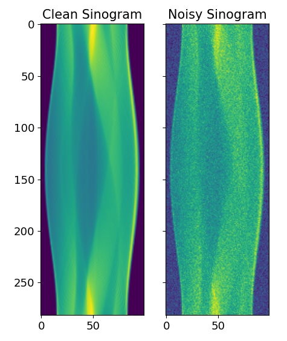
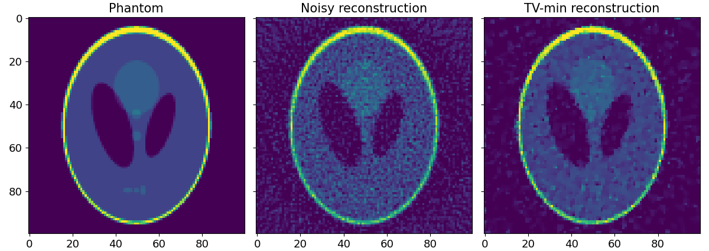
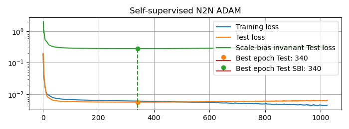
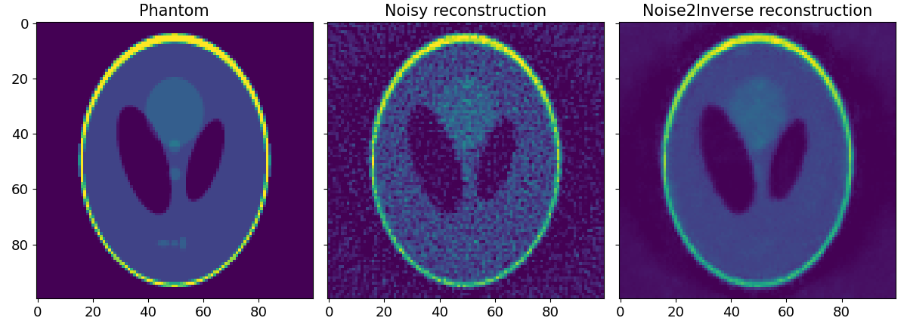
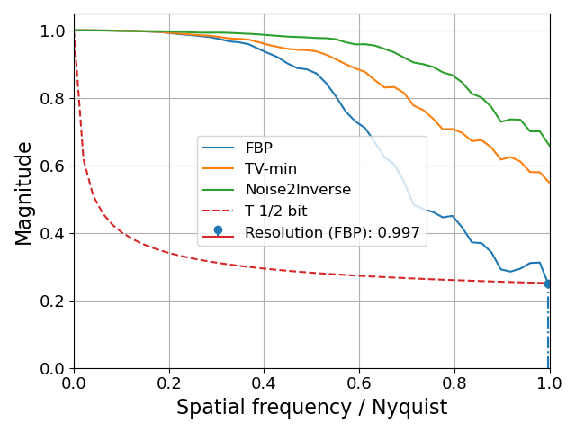

# Tutorial: Using Auto-Denoise (autoden) for Noise2Inverse (Self-Supervised Denoising)

This tutorial demonstrates how to implement Noise2Inverse (self-supervised denoising) using the Auto-Denoise (autoden) library. Noise2Inverse is a self-supervised deep convolutional denoising method for tomography, as described in [1].
This tutorial is a walk-through of example number 03, from the `examples` directory.

- [1] A. A. Hendriksen, D. M. Pelt, and K. J. Batenburg, "Noise2Inverse: Self-Supervised Deep Convolutional Denoising for Tomography," IEEE Transactions on Computational Imaging, vol. 6, pp. 1320–1335, 2020, doi: [10.1109/TCI.2020.3019647](https://doi.org/10.1109/TCI.2020.3019647).

## Setting Up the Data

First, we need to set up the data to be used for training and testing the denoisers. We will use the `skimage` library to generate a phantom image, create a sinogram, add noise to the sinogram, and then reconstruct the noisy sinogram.

```python
import matplotlib.pyplot as plt
import numpy as np
import skimage.data as skd
import skimage.transform as skt
from corrct.models import get_vol_geom_from_data, get_vol_geom_from_volume
from corrct.processing.post import plot_frcs
from corrct.projectors import ProjectorUncorrected
from corrct.solvers import FBP, PDHG
from corrct.regularizers import Regularizer_TV2D
from corrct.testing import add_noise
from skimage.metrics import peak_signal_noise_ratio as psnr
from skimage.metrics import structural_similarity as ssim

import autoden as ad

%load_ext autoreload
%autoreload 2

%matplotlib widget

print("Creating phantom")
phantom = skd.shepp_logan_phantom()
phantom = skt.downscale_local_mean(phantom, 4).astype(np.float32)

print("Creating sinogram")
vol_geom = get_vol_geom_from_volume(phantom)
angles_rad = np.deg2rad(np.linspace(start=0, stop=180, num=int((180 * np.pi) // 2), endpoint=False))
with ProjectorUncorrected(vol_geom, angles_rad) as prj:
    sino_clean = prj.fp(phantom)

print("Adding noise")
sino_noisy, _, _ = add_noise(sino_clean, num_photons=1, readout_noise_std=2)

PIX_TO_INCH = 0.02

fig_size = (sino_clean.shape[-1] * 2 * PIX_TO_INCH, sino_clean.shape[-2] * PIX_TO_INCH)
fig, axes = plt.subplots(1, 2, figsize=fig_size)
axes[0].imshow(sino_clean, cmap='gray')
axes[0].set_title('Clean Sinogram')
axes[1].imshow(sino_noisy, cmap='gray')
axes[1].set_title('Noisy Sinogram')
fig.tight_layout()
plt.show(block=False)
```


## Creating Noisy Reconstructions

We split the sinograms into two sets and create noisy reconstructions using the Filtered Back Projection (FBP) method. This provides two statistically independent reconstructions of the same object. This will be used by N2I to train the denoiser model.

```python
print("Creating noisy reconstructions (FBP)")
vol_geom = get_vol_geom_from_data(sino_clean)
solver = FBP()
with ProjectorUncorrected(vol_geom, angles_rad) as prj:
    rec_noisy = solver(prj, sino_noisy)[0]

# Splitting sinograms
angles_rad_rec = [angles_rad[0::2], angles_rad[1::2]]
sinos_noisy_rec = [sino_noisy[0::2], sino_noisy[1::2]]

recs_noisy = []
for sino, angles in zip(sinos_noisy_rec, angles_rad_rec):
    with ProjectorUncorrected(vol_geom, angles) as prj:
        recs_noisy.append(solver(prj, sino)[0])

recs_noisy_stack = np.stack(recs_noisy, axis=0)
```

## Total Variation Minimization

We perform the Total Variation (TV) minimization reconstruction of the entire noisy sinogram as reference.

```python
reg = Regularizer_TV2D(1e1)
pdhg = PDHG(regularizer=reg, verbose=True)

with ProjectorUncorrected(vol_geom, angles_rad) as prj:
    rec_tv = pdhg(prj, sino_noisy, iterations=500)[0]

PIX_TO_INCH = 0.04
fig_size = (phantom.shape[-1] * 3 * PIX_TO_INCH, phantom.shape[-2] * PIX_TO_INCH)
fig, axs = plt.subplots(1, 3, sharex=True, sharey=True, figsize=fig_size)
axs[0].imshow(phantom)
axs[0].set_title("Phantom")
axs[1].imshow(rec_noisy, vmin=0.0, vmax=1.0)
axs[1].set_title("Noisy reconstruction")
axs[2].imshow(rec_tv, vmin=0.0, vmax=1.0)
axs[2].set_title("TV-min reconstruction")
fig.tight_layout()
plt.show(block=False)
```


## Training the Noise2Inverse Denoiser

We train the N2I denoiser using the split noisy reconstructions.

```python
EPOCHS = 1024 * 1
REG_TV_VAL = 3e-6

print("Denoising reconstructions with N2N")
net_params = ad.NetworkParamsUNet(n_features=24)
denoiser_un = ad.N2N(model=net_params, reg_val=REG_TV_VAL)
n2n_data = denoiser_un.prepare_data(recs_noisy_stack)
denoiser_un.train(*n2n_data, epochs=EPOCHS)
```

The training algorithm sets aside a small portion of the images' pixels to test the quality of the denoised image.
When the training is over, it will automatically select the model weights that exhibit the highest denoising performance (according to the MSE loss) on the said pixel leave-out set.


## Performing Inference

We use the trained N2I model to produce the denoised reconstruction.

```python
rec_n2i = denoiser_un.infer(n2n_data[0]).mean(0)
```

## Visualizing the Results

Finally, we visualize the results of the different denoising methods.

```python
PIX_TO_INCH = 0.04
fig_size = (phantom.shape[-1] * 3 * PIX_TO_INCH, phantom.shape[-2] * PIX_TO_INCH)
fig, axs = plt.subplots(1, 3, sharex=True, sharey=True, figsize=fig_size)
axs[0].imshow(phantom)
axs[0].set_title("Phantom")
axs[1].imshow(rec_noisy, vmin=0.0, vmax=1.0)
axs[1].set_title("Noisy reconstruction")
axs[2].imshow(rec_n2i, vmin=0.0, vmax=1.0)
axs[2].set_title("Noise2Inverse reconstruction")
fig.tight_layout()
plt.show(block=False)
```


## Evaluating the Results

We now evaluate the results using Peak Signal-to-Noise Ratio (PSNR) and Structural Similarity Index (SSIM).

```python
all_recs = [rec_noisy, rec_tv, rec_n2i]
all_labs = ["FBP", "TV-min", "Noise2Inverse"]

print("PSNR:")
for rec, lab in zip(all_recs, all_labs):
    print(f"- {lab}: {psnr(phantom, rec, data_range=1.0):.3}")
print("SSIM:")
for rec, lab in zip(all_recs, all_labs):
    print(f"- {lab}: {ssim(phantom, rec, data_range=1.0):.3}")

plot_frcs([(phantom, rec) for rec in all_recs], all_labs)
```
Resulting in:
````
PSNR:
- FBP: 21.5
- TV-min: 24.8
- Noise2Inverse: 25.2
SSIM:
- FBP: 0.388
- TV-min: 0.558
- Noise2Inverse: 0.707
````

