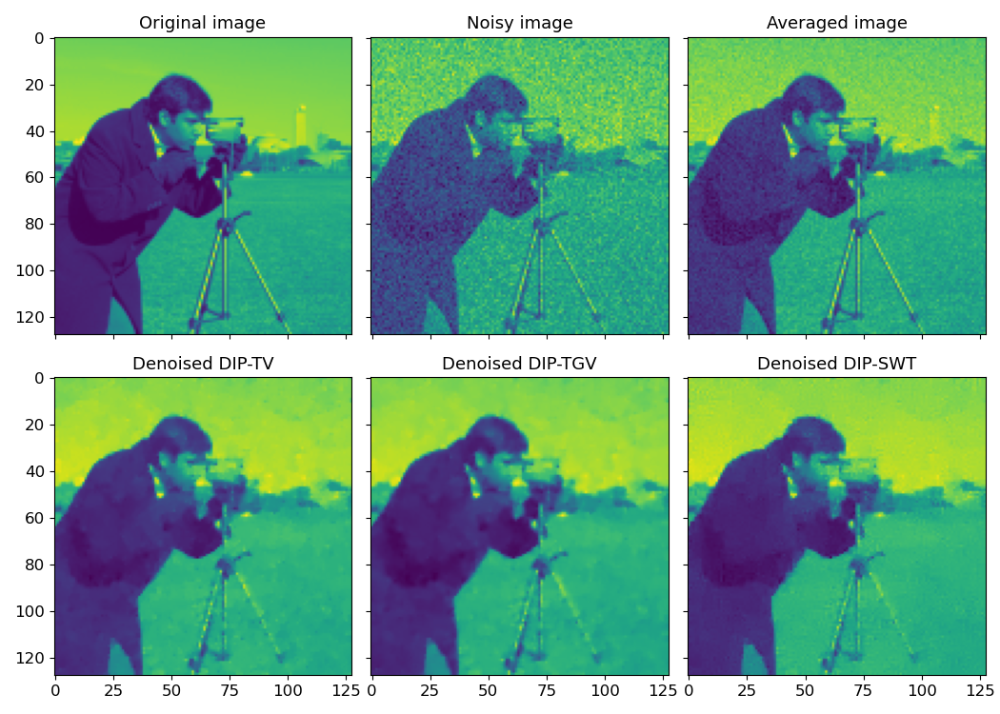
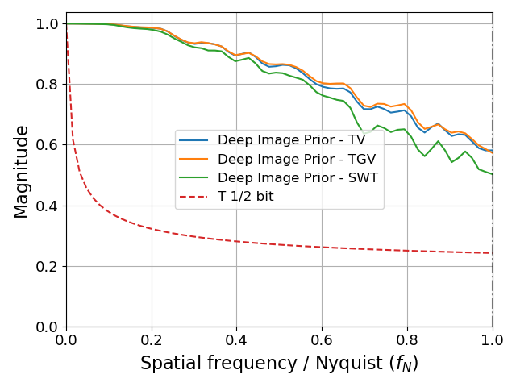

# Regularization in Image Denoising

Auto-Denoise (autoden) provides implementations for a variety of regularization methods that can be used to improve the quality of image denoising. This tutorial will guide you through setting up the data, training different denoisers with different regularization methods, performing inference, and visualizing the results.

## Setting Up the Data

First, we need to set up the data to be used for training and testing the denoisers. We will use the `skimage` library to generate a noisy image and create multiple noisy versions of it.

```python
import matplotlib.pyplot as plt
import numpy as np
import skimage.color as skc
import skimage.data as skd
import skimage.transform as skt
from numpy.typing import NDArray
from tqdm.auto import tqdm
import autoden as ad

USE_CAMERA_MAN = True
NUM_IMGS_TRN = 4
NUM_IMGS_TST = 2
NUM_IMGS_TOT = NUM_IMGS_TRN + NUM_IMGS_TST

EPOCHS = 1024 * 3
REG_TV_VAL = 1e-6

if USE_CAMERA_MAN:
    img_orig = skd.camera()
    img_orig = skt.downscale_local_mean(img_orig, 4)
else:
    img_orig = skd.cat()
    img_orig = skc.rgb2gray(img_orig)
    img_orig *= 255 / img_orig.max()

imgs_noisy: NDArray = np.stack(
    [(img_orig + 20 * np.random.randn(*img_orig.shape)) for _ in tqdm(range(NUM_IMGS_TOT), desc="Create noisy images")],
    axis=0,
)
tst_inds = np.arange(NUM_IMGS_TRN, NUM_IMGS_TOT)

print(f"Img orig -> [{img_orig.min()}, {img_orig.max()}], Img noisy -> [{imgs_noisy[0].min()}, {imgs_noisy[0].max()}]")
print(f"Img shape: {img_orig.shape}")
```

## Training the Denoisers with Different Regularizations

We will train three different denoisers using the Deep Image Prior (DIP) method, each with a different regularization method: Total Variation (TV), Total Generalized Variation (TGV), and Stationary Wavelet Transform (SWT). We first define the type of model that we will want to use. In this case it will be a U-net [[1](#ref.1)], with 16 features:

```python
net_params = ad.NetworkParamsUNet(n_features=16)
model = net_params.get_model()
```

### Total Variation (TV)

Total Variation is a regularization method that encourages piecewise constant solutions. It is defined as the integral of the gradient magnitude of the image.

```python
denoiser_dip_tv = ad.DIP(model=deepcopy(model), reg_val=REG_TV_VAL * 5)
dip_data = denoiser_dip_tv.prepare_data(imgs_noisy)
denoiser_dip_tv.train(*dip_data, epochs=EPOCHS)
```

### Total Generalized Variation (TGV)

Total Generalized Variation is a flavor of Total Variation that encourages piecewise linear solutions. It is defined as the integral of the gradient magnitude of the gradient of the image.

```python
reg_tgv = ad.losses.LossTGV(REG_TV_VAL * 3.5)

denoiser_dip_tgv = ad.DIP(model=deepcopy(model), reg_val=reg_tgv)
denoiser_dip_tgv.train(*dip_data, epochs=EPOCHS)
```

### Stationary Wavelet Transform (SWT)

The Stationary Wavelet Transform is a regularization method that encourages solutions with a specific wavelet representation. It is defined as the integral of the wavelet coefficients of the image.

```python
reg_swt = ad.losses.LossSWTN(lambda_val=REG_TV_VAL * 1.5, min_approx=False)

denoiser_dip_swt = ad.DIP(model=deepcopy(model), reg_val=reg_swt)
denoiser_dip_swt.train(*dip_data, epochs=EPOCHS)
```

## Performing Inference

Inference is the process of using the trained models to denoise new images. The `infer` method takes the noisy images as input and outputs the denoised images.

```python
den_dip_tv = denoiser_dip_tv.infer(dip_data[0])
den_dip_tgv = denoiser_dip_tgv.infer(dip_data[0])
den_dip_swt = denoiser_dip_swt.infer(dip_data[0])
```

## Visualizing the Results

Finally, we visualize the results of the different denoisers.
The reconstructions with TV and TGV regularization tend to exhibit regions with short-scale intensity correlation, while the SWT regularization tends to exhibit a mixture of short and medium range correlations.
While the SWT-min images have perceived higher definition, they tend to have lower scores in PSNR and SSIM.

=== "Image"
    

=== "Code"
    ```python
    fig, axs = plt.subplots(2, 3, sharex=True, sharey=True)
    axs[0, 0].imshow(img_orig)
    axs[0, 0].set_title("Original image")
    axs[0, 1].imshow(imgs_noisy[0])
    axs[0, 1].set_title("Noisy image")
    axs[0, 2].imshow(np.mean(imgs_noisy, axis=0))
    axs[0, 2].set_title("Averaged image")
    axs[1, 0].imshow(den_dip_tv)
    axs[1, 0].set_title("Denoised DIP-TV")
    axs[1, 1].imshow(den_dip_tgv)
    axs[1, 1].set_title("Denoised DIP-TGV")
    axs[1, 2].imshow(den_dip_swt)
    axs[1, 2].set_title("Denoised DIP-SWT")
    fig.tight_layout()
    plt.show(block=False)
    ```

And here below we present the PSNR (Peak Signal-to-Noise Ration), SSIM (Structural Similarity Index) and FRC (Fourier Ring Correlation) of the results.

=== "Image"
    PSNR:

    - Deep Image Prior - TV: 27.5
    - Deep Image Prior - TGV: 27.5
    - Deep Image Prior - SWT: 26.5
    SSIM:

    - Deep Image Prior - TV: 0.81
    - Deep Image Prior - TGV: 0.812
    - Deep Image Prior - SWT: 0.781

    

=== "Code"
    ```python
    from corrct.processing.post import plot_frcs
    from skimage.metrics import peak_signal_noise_ratio as psnr
    from skimage.metrics import structural_similarity as ssim

    all_recs = [den_dip_tv, den_dip_tgv, den_dip_swt]
    all_labs = ["Deep Image Prior - TV", "Deep Image Prior - TGV", "Deep Image Prior - SWT"]

    data_range = img_orig.max() - img_orig.min()
    print("PSNR:")
    for rec, lab in zip(all_recs, all_labs):
        print(f"- {lab}: {psnr(img_orig, rec, data_range=data_range):.3}")
    print("SSIM:")
    for rec, lab in zip(all_recs, all_labs):
        print(f"- {lab}: {ssim(img_orig, rec, data_range=data_range):.3}")

    plot_frcs([(img_orig.astype(np.float32), rec) for rec in all_recs], all_labs)
    ```

## References

1. <a id="ref.1"></a> O. Ronneberger, P. Fischer, and T. Brox, “U-Net: Convolutional Networks for Biomedical Image Segmentation,” in Medical Image Computing and Computer-Assisted Intervention – MICCAI 2015, 2015, pp. 234–241. doi: 10.1007/978-3-319-24574-4_28.